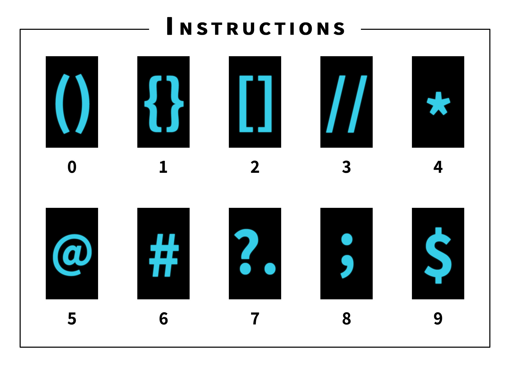

# Code Clock

My submission for the Flutter Clock Challenge.


Check [flutter.dev/clock](https://flutter.dev/clock) for details about the challenge.

How to run:

```dart
  - flutter channel stable
```

```dart
  - flutter upgrade
```

```dart
  - cd digital_clock
```

```dart
  - flutter create .
```

```dart
  - flutter run (on Android in landscape)
```

How to read time:


